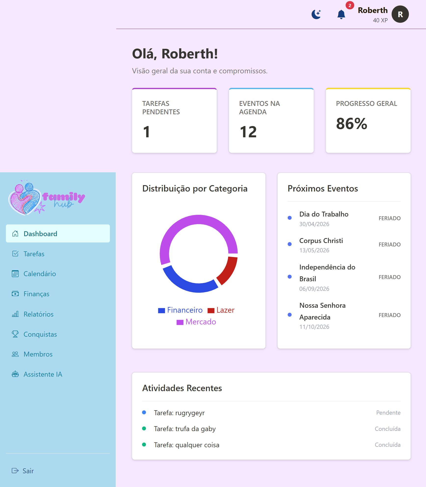

# 📌 FamilyHUB
## 📖 Sobre o Projeto

O **FamilyHUB** é uma aplicação desenvolvida com foco em organização familiar. Ele permite que usuários realizem cadastro, login e gerenciem informações como tarefas, eventos e membros da família de forma simples e eficiente.

---

## 🖼️ Interface do Sistema

<p align="center">
  
</p>

---

## 🚀 Tecnologias Utilizadas

### 🔹 Front-end

HTML
CSS
JavaScript

### 🔹 Back-end

PHP

### 🔹 Banco de Dados

MySQL (Workbench)

---

## 📂 Estrutura do Projeto

```bash
FAMILYHUB/
│
├── api/
│   ├── cadastro.php        # Cadastro de usuários
│   ├── login.php           # Autenticação de usuários
│   ├── conexao.php         # Conexão com banco de dados
│   ├── membros.php         # Gerenciamento de membros
│   ├── tarefas.php         # Controle de tarefas
│   ├── eventos.php         # Controle de eventos
│   ├── upload_foto.php     # Upload de foto de perfil
│   ├── gemini.php          # Integração com API
│   └── add_foto_perfil.sql # Script SQL
│
├── backend/                # Lógica do servidor
├── frontend/               # Interface do usuário
├── logo/                   # Imagens e identidade visual
│
├── database_changes.sql    # Alterações no banco
└── README.md               # Documentação
```
---

## ⚙️ Funcionalidades

✅ Cadastro de usuários
✅ Login e autenticação
✅ Gerenciamento de membros
✅ Controle de tarefas
✅ Organização de eventos
✅ Upload de foto de perfil
✅ Integração com API
